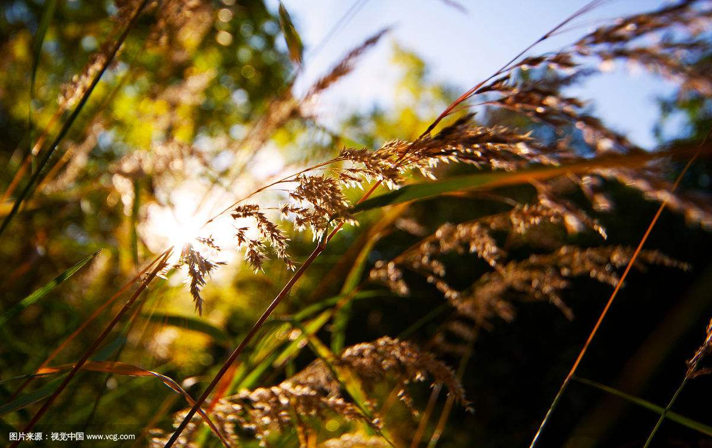
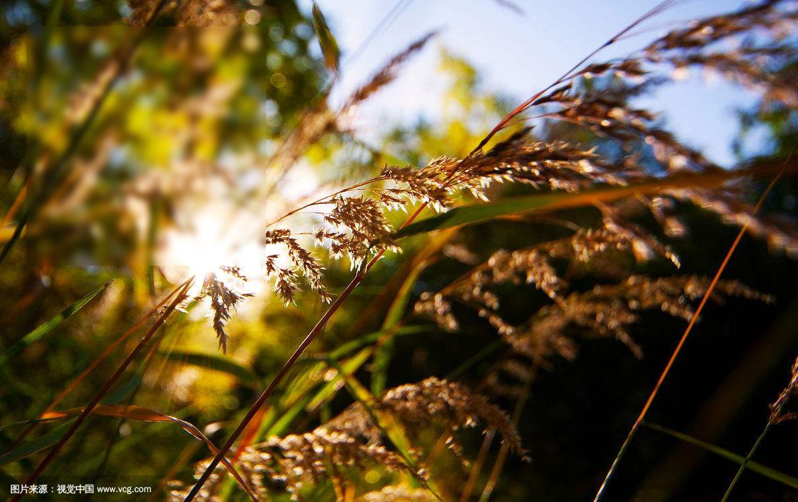
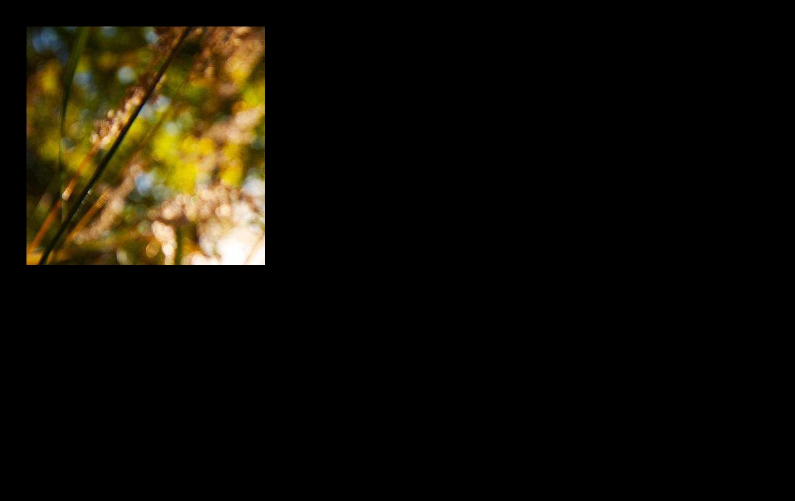

# A tool about blurring/blackening the image in designated areas  
by Guan Mingyang
##  optional arguments:

	-   -h, --help                     show this help message and exit      
	-   --b BETA                     blur degree (default 0.5)  
	-   --out OUTDIR             output dir (default 'output/' )
	-   --imagePath IMAGE_PATH	      The path of image
	-   --Xpoint1 MINX         The X of point1, (if equal -1 then blur/blacken the entire image!)
	-   --Ypoint1 MINY          The Y of point1, (if equal -1 then blur/blacken the entire image!)
	-   --Xpoint2 MAXX        The X of point2, (if equal -1 then blur/blacken the entire  image!)
	-   --Ypoint2 MAXY         The Y of point2, (if equal -1 then blur/blacken the entire image!)
	-   --isturn FLAG             If isturn equal 1, the image is blured except the designated area  (default 0)

-  Xpoint1, Ypoint1, Xpoint2, Ypoint2 and imagePath is required necessarily
-  isturn, out and b is not necessarily

## Example
 eg:$ python blur.py --imagePath image --Xpoint1 40 --Ypoint1 40 --Xpoint2 400 --Ypoint2 400 
 eg:$ python black.py --imagePath image --Xpoint1 40 --Ypoint1 40 --Xpoint2 400 --Ypoint2 400 --isturn 1
## result  
- **orginial image**  

- **after blur**  

- **after black**  

