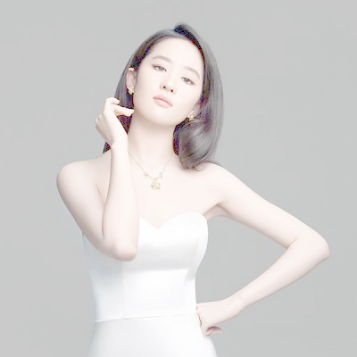
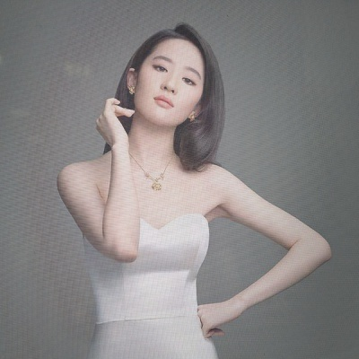

# A Tool making the image looks like fake
by Guan Mingyang
## options:
	-  -h, --help            show this help message and exit
	-  --a ALPA             light degree:   
	                        	  alpa = 1 not change || alpa->0 lighter || alpa -> ∞ darker
	-  --out OUTDIR            output dir (default output/ )
	-  --imagePath IMAGE_PATH    The path of image
## run
 $ sh run.sh

## three operations
### original image  

  
**1. change the light**  

  
  
**2. add the water**  

  
  
**3. create the ghost**  
 